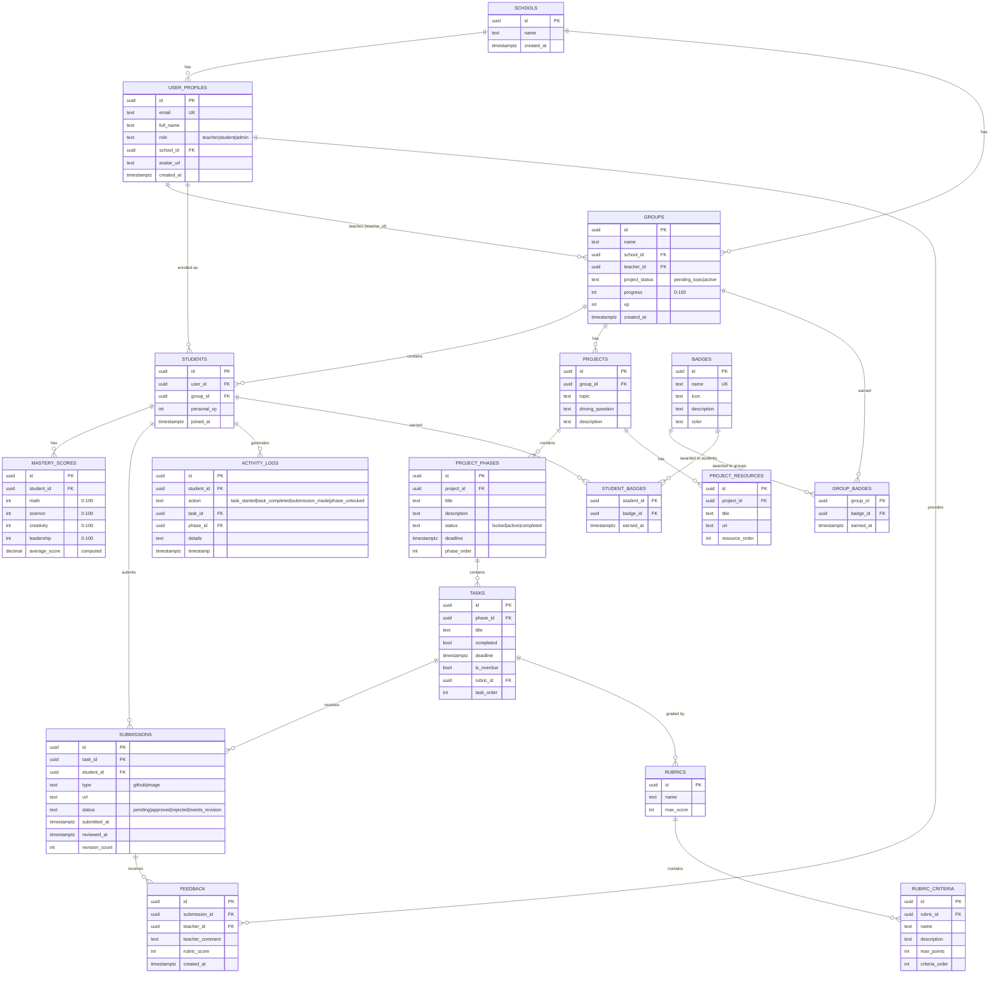

# PBL Platform - Supabase Database Schema

## Key Relationships

### User Management
- **Schools** contain multiple **User Profiles**
- **User Profiles** can be teachers, students, or admins
- Teachers create and manage **Groups**
- Students belong to **Groups** through the **Students** junction table

### Project Structure
- Each **Group** has one **Project**
- **Projects** contain ordered **Project Phases**
- **Phases** contain ordered **Tasks**
- **Resources** provide reference materials

### Submissions & Grading
- **Students** submit work for **Tasks**
- **Submissions** can have **Feedback** from teachers
- **Tasks** can be graded using **Rubrics** with multiple **Criteria**

### Gamification
- **Badges** can be earned by **Groups** (team achievements)
- **Badges** can be earned by **Students** (individual achievements)
- **Activity Logs** track all student actions for analytics

### Analytics
- **Mastery Scores** track skill development
- **Activity Logs** record every student action
- **Timestamps** enable time-based analytics
- **Progress** and **XP** calculated from task completion

## Security Model

All tables use **Row-Level Security (RLS)**:

- Teachers see only their groups and students
- Students see only their group members
- Submissions protected by role-based policies
- Activity logs visible only to relevant parties

## Indexes

Optimized queries for:
- Group lookups by teacher
- Task/submission searches
- Activity log time-series queries
- Student performance analytics
